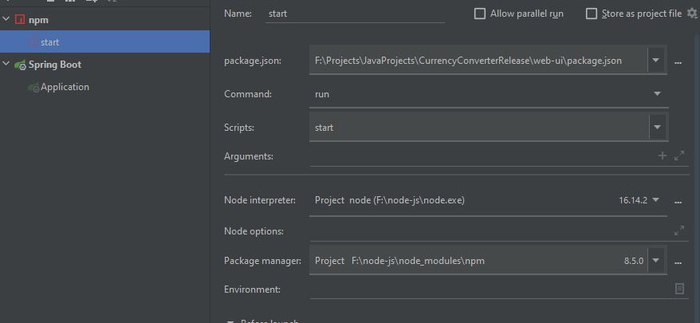
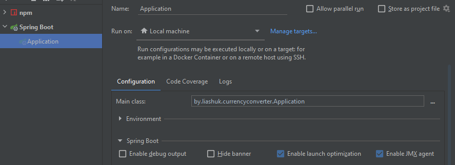
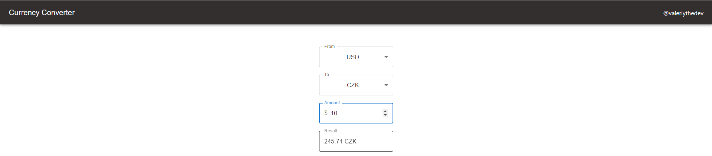

# **Currency-Converter**

`@author Valeriy Liashuk`

## About

This app can be used by a users for converter currencies from one to another.

## Requirements

1. Java **JDK 17**
2. Gradle
3. Spring Boot
    + Web
4. Lombok
5. JSON
6. NodeJS

## Installing

```hgignore
 $ git clone https://github.com/valeriythedev/Currency-Converter.git
```
1. Fill application.yaml with your own API-key [here](https://www.fastforex.io/)
2. Configure build part:
    + Add two build configurations Spring Boot and NPM 
    
      
3. Start back-end side, then front-end side.   
4. Work with converter ;)
    

# CURL Endpoints:

Convert one-to-another currency
```
  GET 'http://localhost:8080/api/currency/convert?from={from: String}&to={to: String}&amount={amount: Float}'
```
Get currencies list
```
  GET 'http://localhost:8080/api/currency/'
```
